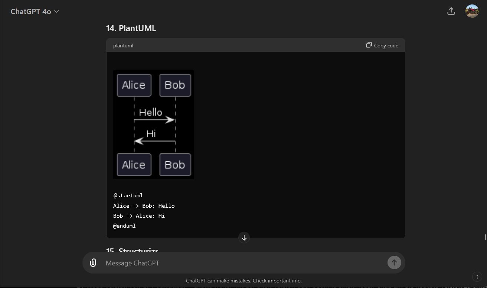

# 🚧 ChatGPT Diagram Renderer 🚧

*This extension is currently only available on firefox and will be available in microsoft extension stores soon! Due to issues Chrome store, Chrome support will take more time*

---

## ChatGPT Diagram Renderer

Renders diagrams and charts like PlantUML, Mermaid, and many more directly in the ChatGPT web interface using [Kroki.io](https://kroki.io). This extension supports a variety of diagram types and ensures that all diagrams are rendered seamlessly within the chat.

## Features

- **Easy Diagram Rendering:** Automatically render diagrams written by ChatGPT.
- **Dark Mode Support:** Darkmode automatically active when active in your system.
- **Zoomable Images:** Click on diagrams to view them in a larger modal.
- **Wide Format Support:** Supports multiple diagram formats via Kroki.io.

## No Bullshit

- No Ads
- No trackers
- No asking for rating the extension
- No asking for donations in your browser
- Only external service used is [Kroki.io](https://kroki.io) to render the images

## Supported Diagrams

This extension supports the following diagram types:

- ActDiag
- BlockDiag
- C4 with PlantUML
- D2
- DBML
- Ditaa
- Excalidraw
- GraphViz
- Mermaid
- Nomnoml
- NwDiag
- PacketDiag
- Pikchr
- PlantUML
- RackDiag
- SeqDiag
- SvgBob
- Symbolator
- UMLet
- Vega
- Vega-Lite
- WaveDrom

**Support for these formats is active, but might not work correctly**

- Erd
- Structurizr
- TikZ
- WireViz

## Installation

The extension is not yet available in the extension stores. Stay tuned for the official release!

<!-- Add extension store badges when available -->
<!-- 

-->

## Usage

1. Install the extension from the [Chrome Web Store](https://chrome.google.com/webstore/detail/your-extension-id) or [Firefox Add-ons](https://addons.mozilla.org/en-US/firefox/addon/your-extension-id) once it is available.
2. Open ChatGPT in your browser.
3. Let ChatGPT create some diagrams.
4. The diagram will be rendered automatically!

## Donations

If you find this extension useful and would like to support its development, consider donating via PayPal.

## Acknowledgments

Special thanks to the developers of [Kroki.io](https://kroki.io) and [Code Copilot](https://promptspellsmith.com/g/g-2DQzU5UZl) for their amazing tools and services.

## License

This project is open source and licensed under the MIT License. See the [LICENSE](LICENSE) file for details.

## Build

Setup node js first!

run `build.bat` if you are on windows.

Otherwise run:

``bash
npm install
npm run build
cd artifacts/
ls
``

Note: If you run this as a temporary extension and not from the extension stores, you need to click on the extension icon while using chatgpt or it will not load. It is a technical limitation of manifest v3.

---

*Thank you for using ChatGPT Diagram Renderer!*

